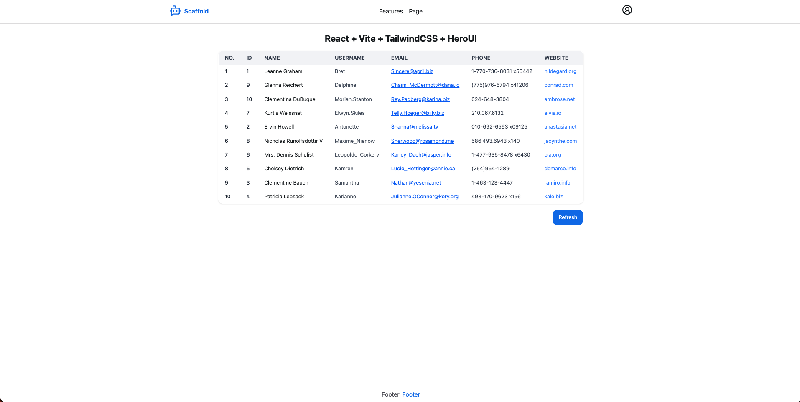

# Scaffold React + Vite + TailwindCSS + HeroUI

A modern, production-ready React starter template featuring Vite for lightning-fast builds, TailwindCSS for utility-first styling, and HeroUI for beautiful pre-built components.



## 🚀 Tech Stack

### Core Framework
- **[React](https://react.dev/)** (v18+) - A JavaScript library for building user interfaces with component-based architecture
- **[TypeScript](https://www.typescriptlang.org/)** - Strongly typed programming language that builds on JavaScript

### Build Tools
- **[Vite](https://vite.dev/)** - Next generation frontend tooling with instant HMR and optimized builds
- **[pnpm](https://pnpm.io/)** - Fast, disk space efficient package manager

### Styling
- **[TailwindCSS](https://tailwindcss.com/)** - Utility-first CSS framework for rapid UI development
- **[PostCSS](https://postcss.org/)** - Tool for transforming CSS with JavaScript plugins

### UI Components
- **[HeroUI](https://heroui.com/)** - Beautiful, accessible React component library built on top of Tailwind
- **[Lucide React](https://lucide.dev/)** - Beautiful & consistent icon toolkit

### Routing & State
- **[React Router](https://reactrouter.com/)** (v6+) - Declarative routing for React applications
- **[TanStack Query](https://tanstack.com/query/)** - Powerful data fetching and caching library

### Animation
- **[Framer Motion](https://www.framer.com/motion/)** - Production-ready motion library for React

### HTTP Client
- **[Axios](https://axios-http.com/)** - Promise-based HTTP client for the browser and Node.js

## 📋 Prerequisites

- **Node.js** 20+ ([Download](https://nodejs.org/))
- **pnpm** ([Installation Guide](https://pnpm.io/installation))

## 🛠️ Installation

```bash
pnpm install
```

## 🏗️ Build

```bash
pnpm run ts-check && \
pnpm run build
```

## 🏃 Development

```bash
pnpm run dev
# or
pnpm run preview
```

## 📱 Production

```bash
docker build -t your-app-name .
docker run -p 2999:2999 your-app-name
```

The application will open automatically at `http://localhost:2999`

## 📁 Project Structure

```
├── public/
│   └── favicon.svg
├── src/
│   ├── components/       # Reusable UI components
│   │   ├── DefaultLayout.tsx
│   │   ├── Footer.tsx
│   │   ├── Navbar.tsx
│   │   └── index.ts
│   ├── pages/            # Route page components
│   │   ├── Home.tsx
│   │   ├── Page.tsx
│   │   └── index.ts
│   ├── css/              # Global styles
│   │   └── index.css
│   ├── index.tsx         # Application entry point
│   ├── Application.tsx   # Route configuration
│   └── Providers.tsx     # HeroUI + other providers configuration
├── index.html
├── vite.config.ts        # Vite configuration
├── tailwind.config.js    # TailwindCSS configuration
├── tsconfig.json         # TypeScript configuration
├── postcss.config.js     # PostCSS configuration
├── package.json          # Dependencies and scripts
└── dockerfile            # Docker configuration
```

## 🎯 Path Aliases

Configured path aliases for cleaner imports:

```typescript
import { Navbar, Button } from "@components";  // src/components
import { Home, Page } from "@pages";           // src/pages
import "@/css/index.css";                      // src/css/index.css
```

## 📄 License

MIT License - Copyright (c) 2025 Bình Nguyễn (JackJack)

See [LICENSE](LICENSE) for details.

## 👤 Author - Bình Nguyễn (JackJack)
- [**Gmail**](mailto:jackjack2000.kahp@gmail.com)
- [**GitHub**](https://github.com/binhnguyen00)
